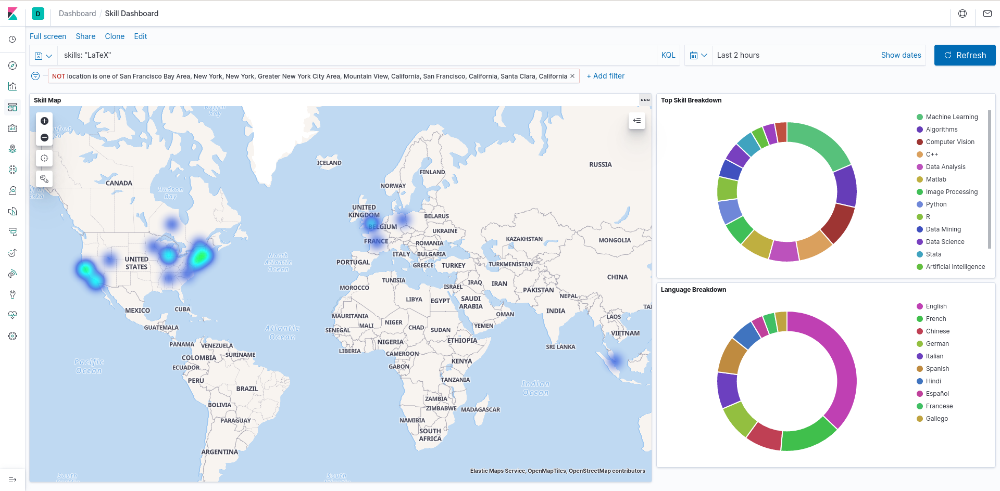
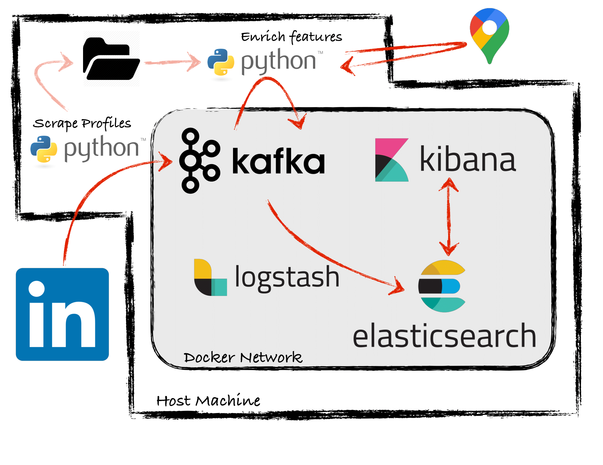

# SkillsInfo
### An environment for geospatially analyzing skills in the labor market

SkillsInfo makes available a Selenium webscraper for LinkedIn crawling, Google's [Geocoding API](https://developers.google.com/maps/documentation/geocoding/start) for enriching information acquired by the webcrawler, and the ELK stack for storage, rapid full-text searching, and geospatial viziualization.

Selenium searches Linkedin pages (via a Google dork) based on a keyword (e.g. "computer_vision"). The results from the first handful of pages arenoted, and then scraped themselves for location, skills (with the three-stop skills noted), and languages spoken. No identifying info such as names, work history, or education history is lifted from the LinkedIn pages. A healthy amount of delays are included during each page's scrape to reduce the load on the underlying webservers at LinkedIn.

### Example
In Kibana, you can easily create visualizations to help draw insights from the data in Elasticsearch. Here, we limited our seach to outside the New York City and San Fransisco areas, and searched for people skilled in LaTeX. The map illustrates the hot-spots for this skill. The top pie chart shows the popularity of other skills held by those skilled in LaTeX, and the bottom pie chart shows the popularity of languages spoken by those skilled in LaTeX.


### Architecture Diagram


### Dependencies
- A Linux host machine
- Python3
- Docker
- A Google Geocoding API Key
- A LinkedIn account
- Google Chrome Browser
- A [chrome driver](https://sites.google.com/a/chromium.org/chromedriver/downloads) for your version of Chrome.

### How To Run:
1. Ensure all dependencies are satisfied and clone the repo
2. Create a file `python/secret.py` that contains one line:
```python
geocoder_api_key="YOUR API KEY"
```
3. Run `./build_environment.sh` to create the python venv and to pull the needed docker images
4. Edit the `logstash/pipeline.yml` file to make logstash read from the topic you will search for. E.g. if you pass in `--topic computer_vision` to the scraper, the topic to read from should be `parsed-computer_vision`.
5. Run `./launch_stack.sh` to spin up your infrastructure.
6. Run the following to start crawling LinkedIn for your desired skills
```bash
cd python
source LI-Scraper/bin/activate
python scraper.py --topic <skill_to_search_spaces_as_underscores> --username <your linkedin username> --password <your linkedin pasword> [ --backup (to write to local json file) --limit n (n number of google pages to consider)] 
```
7. Run the following in a separate terminal window to start parsing
```bash
cd python
source LI-Scraper/bin/activate
python parseGeo.py --topic <same topic you passed in to the scraper> [ --from-file (if you're reading from file. Omit if you consume from kafka) ]
```
8. Data should start showing up in Kibana. Navigate to `localhost:5601` in your browser. Create your index pattern(s), and navigate to Visualizations to create the map visualization.

#### Note
Running Kafka, the ELK stack, and Chrome all at once is very memory intensive. If need be, first just scrape and enrich data writing to Kafka, and only spin up ELK once the web scraping has finished.
